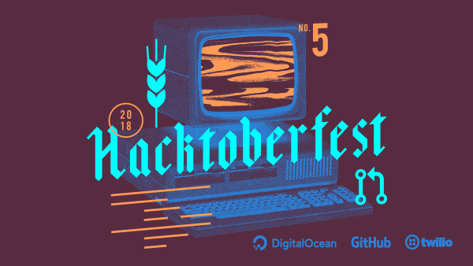

# Selamat Datang Hacktoberfest 2018

# Yodu-Aplikasi-Belajar-Anak-TK
> :school_satchel: Aplikasi Yok (Beta) merupakan aplikasi edukasi anak-anak pra sekolah untuk belajar pengenalan huruf, angka, bentuk, hewan, buah, dan menghitung.

### Tentang

Aplikasi ini disertai dengan audio/ suara dan teks pada menu huruf dan angka.
Masih dalam pengembangan untuk aplikasi ini. 

### Screenshot

| Home        | Alphabet           | Angka           | Bentuk           |
|:-------------:|:-------------:|:-------------:|:-------------:|
|  |  |  |  |

| Hewan        | Buah           | Warna           | Menghitung           |
|:-------------:|:-------------:|:-------------:|:-------------:|
|  |  |  |  |

### Kontribusi
Cari lah suatu fungsi program atau suatu kesalahan dalam mempromosiin program ini seperti :
1. perulangan suara
2. tata letak
3. tidak hanya fungsi program namun bisa lain nya seperti user guide atau lain nya :)

jika kamu sudah berkontribusi jangan lupa tuliskan nama anda di CONTRIBUTION.md
contoh nya seperti ini
#### Name: [Nama lengkap](GitHub link)
- Lokasi: Bintan, Indonesia
- Bio: Software Engineering
- GitHub: [Nama Lengkap Github](GitHub link)

Lalu klik star
